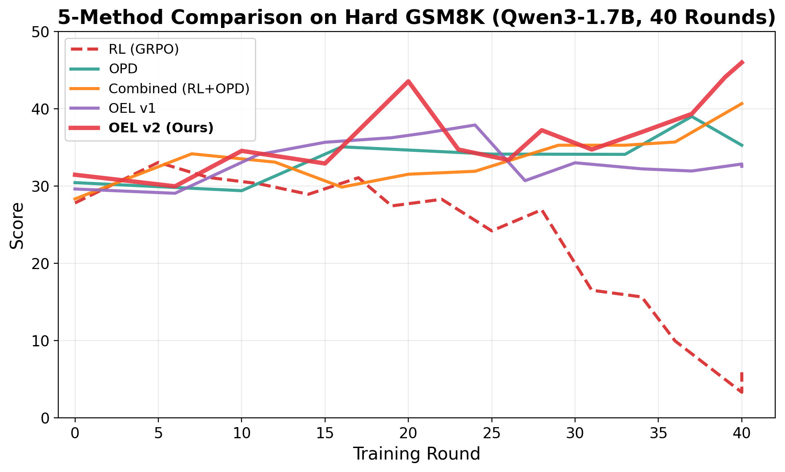
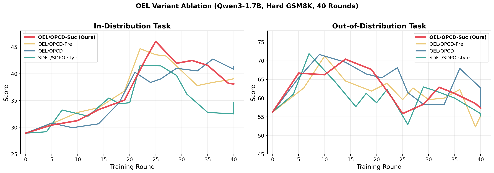
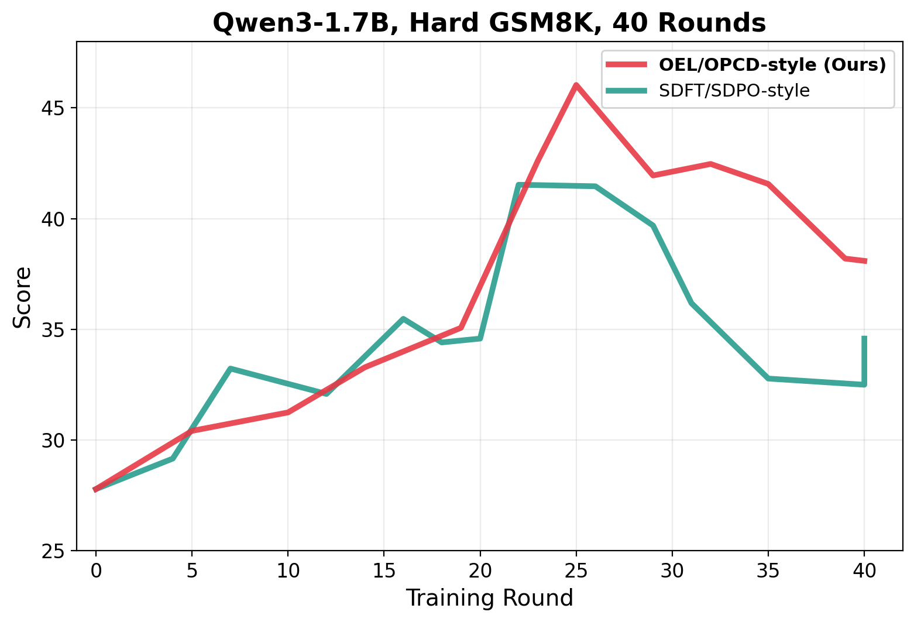

# Online Experiential Learning: Teaching Small LLMs to Personalize Through Experience

**TL;DR:** We train a 1.7B-parameter LLM to write in a personalized, human-like style by distilling structured *experience* from multi-turn conversations. Our method, **Online Experiential Learning (OEL)**, extracts concrete do/don't rules from each training session and uses them to create stronger teacher signals — achieving **46.0** on Hard GSM8K personalization (+19.4 over baseline), outperforming five alternative approaches including pure RL, on-policy distillation, and their combinations.

**Paper:** [Online Experiential Learning with On-Policy Context Distillation](https://arxiv.org/abs/2603.16856)
**Framework:** [OpenClaw](https://arxiv.org/abs/2602.12275) | [Code](https://github.com/Gen-Verse/OpenClaw-RL)

---

## Motivation

Personalized AI agents need to adapt their communication style to individual users — not just solve problems correctly, but respond in ways that feel natural and human-like. This is fundamentally different from standard instruction-following or reasoning tasks: the reward signal is subjective, delayed, and often implicit in multi-turn conversations.

We set out to answer: **Can a small (1.7B) model learn to personalize its style through online training, without hand-labeled preference data?**

## Experimental Setup

We use the [OpenClaw](https://arxiv.org/abs/2602.12275) framework with the following setup:

| Setting | Value |
|---------|-------|
| **Student model** | Qwen3-1.7B (full-parameter, Megatron backend) |
| **Dataset** | Hard GSM8K: 36 train + 36 eval problems (per-problem baseline accuracy $\leq$ 0.25) |
| **User simulator** | GPT-4.1 (role-plays as a student asking for math help) |
| **Evaluator** | GPT-4o (5-vote majority, scores personalization quality 0–100) |
| **Training** | 40 rounds, rollout batch size 16, LR 1e-5 (constant) |
| **Hardware** | 4$\times$ NVIDIA H100 80GB |

The task: a simulated student asks the model to solve math problems. The model must respond in a natural, non-AI-like manner — warm, specific, and personalized. GPT-4o evaluates whether the response reads like a human tutor rather than a generic AI.

## The Journey: Five Methods Compared

We explored five approaches over two weeks of experimentation. Below is the complete learning curve comparison:

<div style="text-align: center;">

</div>

### Method 1: Pure RL (GRPO) — Catastrophic Collapse

Standard Group Relative Policy Optimization with scalar rewards from a process reward model (PRM). **Result: catastrophic.** The model quickly learned to exploit the reward signal, peaking at 33.1 (Round 5) before collapsing to 5.9 by Round 40. The reward hacking problem is severe when the objective is subjective style quality.

### Method 2: On-Policy Distillation (OPD / SDFT/SDPO-style)

Per-turn distillation following [SDFT](https://arxiv.org/abs/2601.19897) and [SDPO](https://arxiv.org/abs/2601.20802): after each turn, extract a hindsight hint from next-state feedback and use it to create a teacher signal. Training minimizes reverse KL divergence over the teacher's top-K token distribution. **Result: stable but limited.** Peak 39.0 at Round 37, no collapse, but gains plateau early.

### Method 3: Combined (RL + OPD)

Joint training with both GRPO reward loss and OPD distillation loss. **Result: best stability among early methods.** Peak 40.7 at Round 40, no collapse, steady improvement. However, the RL component adds noise without clear benefit over pure distillation.

### Method 4: OEL v1 (Abstract Experience)

Our first attempt at experience-augmented distillation. After each session, we extracted abstract "insights" (e.g., *"The model should be more natural"*) and used them to augment the teacher prompt. **Result: moderate.** Peak 37.9 at Round 24, then gradual decline. The abstract insights lacked actionable specificity.

### Method 5: OEL v2 (Concrete Rules) — Best

We redesigned the extraction prompt to produce **concrete do/don't rules** with deduplication (e.g., *"DO: Use casual language like 'let me walk you through this'. DON'T: Start responses with 'Certainly!' or 'Of course!'"*). **Result: best overall.** Peak **46.0** at Round 40 — the highest score achieved, with a +19.4 improvement over baseline.

### Summary Table

| Method | Baseline | Peak | $\Delta$ | Final | Collapse? |
|--------|:--------:|:----:|:--------:|:-----:|:---------:|
| RL (GRPO) | 27.8 | 33.1 | +5.3 | 5.9 | Yes |
| OPD (SDFT/SDPO-style) | 30.4 | 39.0 | +8.6 | 35.3 | No |
| Combined (RL+OPD) | 28.3 | 40.7 | +12.4 | 40.7 | No |
| OEL v1 (abstract) | 29.6 | 37.9 | +8.3 | 32.5 | No |
| **OEL v2 (concrete)** | **31.5** | **46.0** | **+14.5** | **46.0** | **No** |

**Key insight:** The quality of the extraction prompt matters enormously. Switching from abstract insights (v1) to concrete do/don't rules (v2) improved peak score by +8.1 points.

## Deep Dive: OEL Variants

With OEL v2 established as the best extraction strategy, we conducted a controlled ablation over the experience injection mechanism. The core question: **when and how should experience be injected into the teacher prompt?**

We compared four variants:

1. **SDFT/SDPO-style** (baseline): Per-turn hindsight hints, no persistent experience.
2. **OPCD**: Cross-session experience accumulation — experience grows across sessions but is not session-specific.
3. **OPCD-Pre**: Single-session, pre-extraction — extract experience per-turn within the session before the teacher query.
4. **OPCD-Suc** (ours): Single-session, post-extraction — complete the entire student session first, extract ONE structured experience from the full conversation, then **replay** the teacher evaluation on ALL turns with the complete experience.

<div style="text-align: center;">

</div>

### Results

| Variant | Baseline | Peak | $\Delta$ | Peak Round |
|---------|:--------:|:----:|:--------:|:----------:|
| SDFT/SDPO-style | 29.0 | 41.5 | +12.6 | R22 |
| OPCD | 28.3 | 42.7 | +14.5 | R36 |
| OPCD-Pre | 31.8 | 44.7 | +12.9 | R22 |
| **OPCD-Suc (Ours)** | **26.6** | **46.0** | **+19.4** | **R25** |

OPCD-Suc achieves the largest absolute improvement (+19.4), and is the only variant to reach 46+. The key advantage: by extracting experience from the *complete* session and replaying it on all turns, even the first turn benefits from full-session hindsight. This creates a strictly stronger teacher signal than any incremental approach.

On the out-of-distribution task (right panel), all methods maintain stable scores in the 55–70 range, indicating that personalization training does not degrade performance on unseen task types.

## The OEL Pipeline

The final OEL/OPCD-style pipeline operates in three phases:

```
Phase 1: Student Generation (no teacher overhead)
┌─────────────────────────────────────────────┐
│  Student responds to all turns using the    │
│  current policy with a bare prompt           │
│  (no experience, no hints)                   │
└─────────────────────────────────────────────┘
                    ↓
Phase 2: Experience Extraction (post-hoc)
┌─────────────────────────────────────────────┐
│  After the session ends, extract ONE         │
│  structured experience from the entire       │
│  conversation: concrete do/don't rules       │
│  (capped at 2048 tokens)                     │
└─────────────────────────────────────────────┘
                    ↓
Phase 3: Teacher Replay (all turns)
┌─────────────────────────────────────────────┐
│  Replay teacher evaluation on ALL turns      │
│  with the complete experience appended to    │
│  the prompt. Collect top-K (K=50) teacher    │
│  log-probs per token position.               │
└─────────────────────────────────────────────┘
                    ↓
Training: top-K reverse KL divergence
  D_KL(student^{K+1} || teacher^{K+1})
```

The training loss follows SDFT/SDPO-style top-K reverse KL divergence:

$$\mathcal{L} = \sum_{k=1}^{K+1} \pi_\theta^{(k)} \left( \log \pi_\theta^{(k)} - \log \pi_{\text{teacher}}^{(k)} \right)$$

where the $K+1$-th bin aggregates tail mass beyond the top-K tokens.

## Lessons Learned

1. **Pure RL is dangerous for subjective tasks.** GRPO collapses catastrophically when optimizing personalization quality — the reward signal is too noisy and exploitable.

2. **Distillation provides stable learning.** All distillation-based methods (OPD, OEL, Combined) avoid collapse and show steady improvement.

3. **Experience quality > experience quantity.** Concrete, actionable rules (v2) vastly outperform abstract insights (v1). The extraction prompt design is a critical hyperparameter.

4. **Post-hoc extraction + replay is optimal.** By deferring experience extraction to after the full session and replaying on all turns, every training sample benefits from complete hindsight — including Turn 1, which otherwise has no experience context.

5. **Session-level experience > turn-level hints.** OEL methods consistently outperform per-turn OPD, suggesting that session-level patterns are more informative than individual turn feedback for personalization.

## Final Result

<div style="text-align: center;">

</div>

OEL/OPCD-style achieves **46.0** peak score on Hard GSM8K personalization, a **+19.4** improvement over the 26.6 baseline, and consistently outperforms the SDFT/SDPO-style baseline throughout training.

## Reproduce

```bash
# 1. Pull Docker image
docker run -d --name openclaw-slime --gpus all --network host --shm-size 64g \
  -v $(pwd)/models:/workspace/models \
  -v $(pwd):/workspace/OpenClaw-RL \
  slimerl/slime:latest sleep infinity

# 2. Download model
huggingface-cli download Qwen/Qwen3-1.7B --local-dir models/Qwen3-1.7B

# 3. Train (inside container)
docker exec -it openclaw-slime bash
cd /workspace/OpenClaw-RL/openclaw-oel
bash run_qwen3_1.7b_openclaw_oel_online.sh

# 4. Evaluate (separate terminal)
cd openclaw-oel/eval
export OPENAI_API_KEY="sk-..."
python3 gsm8k_personal_agent.py \
    --method oel --training-rounds 40 --eval-every 2 \
    --problem-file ../data/hard_problems_train.json \
    --eval-problem-file ../data/hard_problems_eval.json
```

## References

- [OpenClaw: Building Personalized AI Agents through Real-Time Human-LLM Collaboration](https://arxiv.org/abs/2602.12275)
- [Online Experiential Learning with On-Policy Context Distillation](https://arxiv.org/abs/2603.16856)
- [SDFT: Self-Play Fine-Tuning of LLMs](https://arxiv.org/abs/2601.19897)
- [SDPO: Self-Play Distillation for LLMs](https://arxiv.org/abs/2601.20802)
