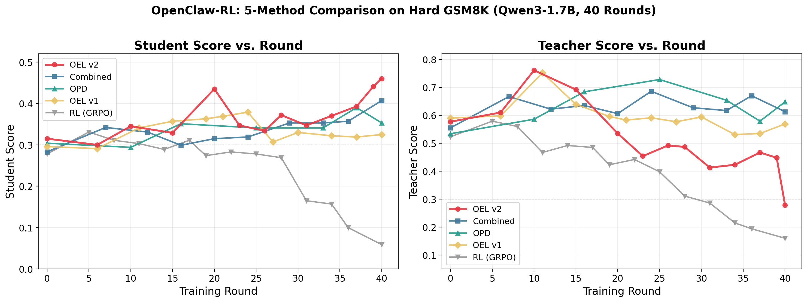

# OpenClaw OEL — Online Experiential Learning

Unified framework for experiential learning, supporting both **online** (OPCD-style)
and **offline** (OEL-style iterative) training modes. The core idea: a student model
learns from deployment interactions by distilling knowledge from an
**experience-augmented teacher**, progressively internalizing accumulated experience
without needing it in the prompt at inference time.

**References:**
- **OEL**: Online Experiential Learning for Language Models ([arXiv: 2603.16856](https://arxiv.org/abs/2603.16856))
- **OPCD**: On-Policy Context Distillation ([arXiv: 2602.12275](https://arxiv.org/abs/2602.12275))

## Key Results

5-method comparison on **Hard GSM8K** (36 problems, baseline accuracy <= 0.25), Qwen3-1.7B
full-parameter, 40 training rounds, GPT-4o evaluator (5 votes), temperature=0:

| Rank | Method | Baseline | Peak Student | Final Student | Trend |
|------|--------|----------|-------------|---------------|-------|
| 1 | **OEL v2** | 0.315 | **0.460** | **0.460** | Late-stage surge |
| 2 | Combined (GRPO+OPD) | 0.283 | 0.407 | 0.407 | Steady improvement |
| 3 | OPD | 0.304 | 0.390 | 0.353 | Peaks then declines |
| 4 | OEL v1 | 0.296 | 0.379 | 0.325 | Mid-late decline |
| 5 | RL (GRPO) | 0.278 | 0.331 | 0.059 | Catastrophic collapse |



**Key takeaways:**
- **OEL v2 achieves the highest student score** (0.460), with a unique "late-stage surge" pattern (steps 19-23)
- **Pure RL (GRPO) collapses catastrophically** — distillation is essential for stable personalization training
- **v2 prompt vs v1**: +21% peak improvement, +42% final improvement — concrete do/don't rules >> abstract platitudes
- By the end, **student surpasses teacher** (0.460 vs 0.279), meaning the student has fully internalized the experience

Regenerate the figure:
```bash
python3 scripts/plot_step_vs_score.py
```

## How It Works

### Core Mechanism: Experience-Augmented Context Distillation

```
External Environment / Agent
        |
        v  HTTP POST /v1/chat/completions
OpenClawOELAPIServer (FastAPI proxy, Port 30000)
        |
   +----+----+
   v         v
SGLang      SGLang (PRM/Teacher)
(Student)   - Teacher log-probs (experience-augmented prompt)
1 GPU       - Experience extraction via generation
   |        1 GPU
   v
output_queue -> AsyncRolloutWorker -> Slime train_async.py (2 GPU Actor)
                                         |
                                         v
                                  oel_distillation_loss
                                  KL(student || teacher) + entropy
```

1. **Student** serves the user with bare prompts (no experience)
2. **Teacher** (same architecture) sees prompts **augmented with accumulated experience** text
3. Student is trained to match teacher's output distribution via **top-K KL divergence**
4. After each session, a **PRM engine** extracts structured experience items from the conversation
5. Experience accumulates across sessions (capped at 2048 tokens), creating a growing knowledge base
6. Over time, the student internalizes experience without needing it at inference

### Loss Function

Top-K KL distillation with tail approximation (`oel_distillation_loss.py`):
- Computes KL divergence over teacher's top-K tokens (default K=50) plus a "tail bin"
- Tail bin captures remaining probability mass: `log(1 - sum(exp(topk_logprobs)))`
- Optional entropy regularization: `loss = kl_loss - entropy_coef * entropy`
- Supports both **Megatron** (tensor-parallel) and **FSDP** backends

### v2 vs v1 Extraction Prompt

| Aspect | v1 (general) | v2 (specific) |
|--------|---------------|---------------|
| Instruction | "general, high-level, widely applicable insight" | "concrete do/don't rules with specific examples" |
| Example | "Use natural language" | "Write '16 minus 7 is 9' instead of '16 - 7 = 9'" |
| Dedup | None | "Do NOT repeat insights already present" |
| No-op | Always appends | Supports "No new experience." output |
| Student Peak | 0.379 | **0.460** (+21%) |

## OEL vs OPD: What Changed

OEL (`openclaw-oel/`) is the **unified successor** of OPD (`openclaw-opd/`), with OPD's
functionality fully subsumed. Setting `OPENCLAW_OEL_MODE=online` is functionally equivalent
to OPD. Below is a comprehensive comparison of what OEL adds, changes, and removes.

### Feature Comparison

| Feature | OPD | OEL |
|---------|-----|-----|
| **Knowledge augmentation** | Per-turn ephemeral hints | Persistent accumulated experience |
| **Knowledge source** | Next-state judge extracts hint per turn | Session-end PRM extracts experience items |
| **Knowledge injection** | Appends `[user's hint]` to last user msg | Wraps user msg in experience template |
| **Sample gatekeeping** | Drops sample if no valid hint found | Never drops — all samples accepted |
| **Operational modes** | 1 (always online) | 4 (`online` / `extract` / `deploy` / `consolidate`) |
| **Offline training** | Not supported | Yes (3-phase iterative rounds) |
| **Multi-experience pool** | No | Yes (random sampling from snapshots) |
| **Top-K source** | Teacher only (hardcoded) | Teacher or Student (configurable) |
| **Trajectory saving** | No | Yes (JSON per session) |
| **Last-turn handling** | Dropped (no next-state) | Teacher evaluates with `[session ended]` |
| **No-teacher fallback** | Training impossible without PRM | Uses student logprobs as teacher |
| **Extraction prompts** | N/A (uses judge prompt) | v1, v2, or custom file path |
| **Experience dedup** | N/A | v2 prompt + "no new experience" check |
| **Experience persistence** | N/A | Saved to disk per session, loadable on startup |
| **Iterative round script** | No | `run_oel_round.sh` |
| **Session cleanup API** | No | `DELETE /v1/sessions/{session_id}` |
| **Experience metrics** | No | chars, sessions, items, pool_size |
| **Code size** | ~1,363 lines | ~1,983 lines (+45%) |

### Key Architectural Differences

#### 1. Hint System (OPD) → Experience System (OEL)

**OPD** uses a **per-turn, ephemeral hint** system:
- When a next-state arrives, a PRM judge is prompted with the assistant's response + next state
- Judge votes `1` (useful) or `-1` (not useful) and optionally wraps a hint in `[HINT_START]...[HINT_END]`
- The longest valid hint among `m` votes is selected; if no valid hint → **sample is dropped**
- Hints are injected as `\n\n[user's hint / instruction]\n{hint}` appended to the last user message
- Hints are **ephemeral** — they don't persist across turns or sessions

**OEL** replaces this with a **persistent experience accumulation** system:
- On `session_done`, the entire conversation is formatted and sent to the PRM engine with an extraction prompt (v1/v2/custom)
- PRM generates `- EXPERIENCE ITEM: ...` lines, which are parsed and appended to the global experience text
- Experience is truncated to `OPENCLAW_OEL_EXPERIENCE_MAX_LENGTH` tokens (default 2048), keeping the most recent items
- Experience is injected via `EXPERIENCE_SOLVE_PROMPT_TEMPLATE` which wraps the user prompt
- Experience **persists across all sessions** within a run and is saved to disk as snapshots
- **No sample dropping** — teacher always sees experience-augmented prompt, all samples are accepted

#### 2. Single Mode (OPD) → 4 Modes (OEL)

OPD has no concept of modes — it always runs online training.

OEL introduces 4 modes via `OPENCLAW_OEL_MODE`:

| Mode | Training? | Experience Extraction? | Trajectory Save? | Teacher Logprobs? |
|------|-----------|----------------------|-----------------|-------------------|
| `online` | Yes | Yes | Optional | Yes |
| `extract` | No | Yes | Optional | No |
| `deploy` | No | No | Yes | No |
| `consolidate` | Yes | No | N/A | Yes |

In `extract`/`deploy` modes, the rollout function returns empty samples and teacher evaluation is skipped entirely.

#### 3. Loss Function: Student Top-K Source (OEL-only)

OPD always selects top-K tokens from the **teacher's** distribution.

OEL adds `OPENCLAW_OEL_TOPK_SOURCE=student` option:
- Top-K tokens selected from the **student's** distribution
- Teacher logprobs gathered at student's top-K positions
- Challenge: teacher's stored top-K may not contain student's tokens → requests 20x more teacher logprobs
- Unmatched tokens use tail probability approximation (`VOCAB_SIZE_APPROX = 151936`)
- New function: `_gather_teacher_at_student_topk()` (~60 lines)

#### 4. Last-Turn & No-Teacher Handling (OEL-only)

**Last turn**: OPD drops the last turn of each session (no next-state available). OEL's
`_finalize_last_turn()` fires teacher evaluation with `"[session ended]"` as the next state,
recovering this training signal.

**No-teacher fallback**: If PRM is not enabled, OPD cannot produce training samples at all.
OEL's `_submit_turn_sample_no_teacher()` uses the student's own logprobs as teacher logprobs,
allowing training to proceed (useful for debugging or teacher-free experiments).

#### 5. Multi-Experience Pool (OEL-only)

When `OPENCLAW_OEL_MULTI_EXPERIENCE=1`:
- Loads an `experience_list.txt` containing paths to multiple experience snapshots
- `get_experience_for_turn()` **randomly samples** one experience per turn from the pool
- Enables experience diversity during consolidation training
- Used in the 3-phase iterative pipeline where different training stages produce different experiences

#### 6. Trajectory Saving/Loading (OEL-only)

When `OPENCLAW_OEL_DEPLOY_SAVE_DIR` is set:
- `_save_session_trajectory()` saves per-session JSON files as `traj_{session_id}.json`
- Each trajectory contains: `session_id`, `timestamp`, array of turns with `prompt_ids`, `response_ids`, `response_logprobs`, `prompt_text`, `response_text`, `messages`, `tools`
- Trajectories from `deploy` mode are loaded during `consolidate` mode for offline training

### What Was Removed from OPD

| OPD Feature | Status in OEL | Reason |
|-------------|---------------|--------|
| Hint judge pipeline (`_build_hint_judge_messages`, `_parse_judge_result`, `_select_best_hint`) | **Removed** | Replaced by experience extraction |
| Hint-based sample dropping | **Removed** | OEL accepts all samples |
| `[HINT_START]...[HINT_END]` regex parsing | **Removed** | Not needed |
| Per-turn PRM record logging (`_append_prm_record`) | **Removed** | Simplified logging |
| Detailed PRM eval prompt (with negative signal examples) | **Simplified** | More concise version |
| Full response content logging | **Truncated** | Logs `content[:200]` only |

## Modes

### Online Mode (Recommended)

All-in-one: inference + experience extraction + distillation training happen simultaneously.

```bash
# Qwen3-1.7B, full-parameter, Megatron backend
bash run_qwen3_1.7b_openclaw_oel_online.sh

# Qwen3-4B, LoRA, FSDP backend
bash run_qwen3_4b_openclaw_oel_online.sh

# Qwen3-4B, full-parameter, Megatron backend
bash run_qwen3_4b_openclaw_oel_online_megatron.sh
```

### OEL Iterative Mode (3-Phase Rounds)

Each round consists of three phases:

1. **Extract** — Deploy model, collect trajectories, extract experience items
2. **Deploy** — Collect deployment trajectories with fixed experience
3. **Consolidate** — Distillation training with experience-augmented teacher

```bash
# Single round
ROUND=1 MODEL_PATH=models/Qwen3-4B bash run_oel_round.sh

# Next round uses previous checkpoint
ROUND=2 MODEL_PATH=/tmp/oel-consolidate-round1/ckpt/latest bash run_oel_round.sh
```

Or run phases individually:

```bash
# Phase 1: Extract experience
EXP_NAME=oel-extract-round1 SEED=42 bash run_qwen3_4b_openclaw_oel_extract.sh

# Build experience list for consolidation
python tools/make_exp_list.py \
  --exp-name oel-extract-round1 \
  --ckpt-start 50 --ckpt-end 250 --ckpt-step 50 \
  --val-samples-limit 100 --val-samples-use 50

# Phase 2: Collect trajectories
EXP_NAME=oel-deploy-round1 bash run_qwen3_4b_openclaw_oel_deploy.sh

# Phase 3: Consolidation training
EXP_NAME=oel-consolidate-round1 \
  EXP_PATH=/tmp/oel-extract-round1/experience_list.txt \
  DEPLOY_SAVE_DIR=/tmp/oel-deploy-round1/deploy_data \
  bash run_qwen3_4b_openclaw_oel_consolidate.sh
```

## Environment Variables

| Variable | Default | Description |
|----------|---------|-------------|
| `OPENCLAW_OEL_MODE` | `online` | Mode: `online`, `extract`, `deploy`, `consolidate` |
| `OPENCLAW_OEL_EXTRACTION_PROMPT` | `v2` | Extraction prompt: `v1`, `v2`, or file path |
| `OPENCLAW_OEL_EXPERIENCE_MAX_LENGTH` | `2048` | Max tokens for experience text window |
| `OPENCLAW_OEL_EXPERIENCE_PATH` | (none) | Path to experience file or experience_list.txt |
| `OPENCLAW_OEL_MULTI_EXPERIENCE` | `0` | Enable multi-experience pool (random sampling) |
| `OPENCLAW_OEL_NO_ACCUMULATE` | `0` | Replace (instead of append) global experience per session |
| `OPENCLAW_OEL_SESSION_EXPERIENCE` | `0` | Per-session, per-turn experience extraction (no cross-session) |
| `OPENCLAW_OEL_DEPLOY_SAVE_DIR` | (none) | Directory to save/load trajectories |
| `OPENCLAW_OEL_TOPK_SOURCE` | `teacher` | Top-K selection source: `teacher` or `student` |
| `OPENCLAW_UPDATE_PRM_WEIGHTS` | `0` | `0`=teacher frozen, `1`=teacher co-evolves with student |
| `TRAIN_STEPS` | `1` | Gradient steps per rollout (batch = TRAIN_STEPS x 16) |
| `OPENCLAW_RECORD_ENABLED` | `0` | Enable session recording to JSONL |
| `OPENCLAW_RECORD_FILE` | `results/record.jsonl` | Path for record output |
| `OPENCLAW_EVAL_MODE` | `0` | Enable PRM eval scoring for monitoring |

## Experiment Results (Detailed)

### OEL v2 — Step-by-Step

| Round | Step | Student | Teacher |
|-------|------|---------|---------|
| 0 | 0 | 0.315 | 0.577 |
| 6 | 3 | 0.300 | 0.610 |
| 10 | 5 | 0.345 | 0.761 |
| 15 | 7 | 0.329 | 0.692 |
| 20 | 9 | 0.435 | 0.535 |
| 23 | 11 | 0.347 | 0.454 |
| 26 | 13 | 0.334 | 0.492 |
| 28 | 15 | 0.372 | 0.487 |
| 31 | 17 | 0.347 | 0.413 |
| 34 | 19 | 0.370 | 0.423 |
| 37 | 21 | 0.393 | 0.467 |
| 39 | 23 | 0.441 | 0.448 |
| 40 | final | **0.460** | 0.279 |

### OEL v1 — Step-by-Step

| Round | Step | Student | Teacher |
|-------|------|---------|---------|
| 0 | 0 | 0.296 | 0.590 |
| 6 | 3 | 0.291 | 0.598 |
| 11 | 5 | 0.341 | 0.752 |
| 15 | 7 | 0.357 | 0.639 |
| 19 | 9 | 0.363 | 0.596 |
| 21 | 11 | 0.369 | 0.583 |
| 24 | 13 | 0.379 | 0.591 |
| 27 | 15 | 0.307 | 0.577 |
| 30 | 17 | 0.330 | 0.594 |
| 34 | 19 | 0.322 | 0.531 |
| 37 | 21 | 0.319 | 0.535 |
| 40 | final | 0.325 | 0.569 |

### Combined (GRPO + OPD) — Step-by-Step

| Round | Step | Student | Teacher |
|-------|------|---------|---------|
| 0 | 0 | 0.283 | 0.555 |
| 7 | 3 | 0.342 | 0.667 |
| 12 | 5 | 0.331 | 0.622 |
| 16 | 7 | 0.299 | 0.635 |
| 20 | 9 | 0.315 | 0.606 |
| 24 | 11 | 0.319 | 0.686 |
| 29 | 13 | 0.353 | 0.627 |
| 33 | 15 | 0.353 | 0.617 |
| 36 | 17 | 0.357 | 0.670 |
| 40 | final | **0.407** | 0.613 |

### OPD — Step-by-Step

| Round | Step | Student | Teacher |
|-------|------|---------|---------|
| 0 | 0 | 0.304 | 0.534 |
| 10 | 3 | 0.294 | 0.586 |
| 16 | 5 | 0.351 | 0.684 |
| 25 | 7 | 0.341 | 0.728 |
| 33 | 9 | 0.341 | 0.654 |
| 37 | 11 | 0.390 | 0.579 |
| 40 | final | 0.353 | 0.648 |

### RL (GRPO) — Step-by-Step

| Round | Step | Student | Teacher |
|-------|------|---------|---------|
| 0 | 0 | 0.278 | 0.523 |
| 5 | 3 | 0.331 | 0.579 |
| 8 | 5 | 0.311 | 0.560 |
| 11 | 7 | 0.303 | 0.467 |
| 14 | 9 | 0.289 | 0.492 |
| 17 | 11 | 0.311 | 0.485 |
| 19 | 13 | 0.274 | 0.423 |
| 22 | 15 | 0.283 | 0.442 |
| 25 | 17 | 0.278 | 0.398 |
| 28 | 19 | 0.269 | 0.311 |
| 31 | 21 | 0.165 | 0.286 |
| 34 | 23 | 0.157 | 0.215 |
| 36 | 25 | 0.100 | 0.194 |
| 40 | final | 0.059 | 0.160 |

### Other Experiments

| Experiment | Model | Key Finding |
|------------|-------|-------------|
| Big Teacher (Student=1.7B, Teacher=4B) | 1.7B | Best 1.7B improvement: +0.131 at peak |
| Multi-step + Teacher Update | 1.7B | Teacher collapsed (0.602->0.059), co-training harmful |
| 4B OPD (Megatron, full-param) | 4B | Largest improvement: +0.396 (0.343->0.739) |

## Files

| File | Purpose |
|------|---------|
| `openclaw_oel_api_server.py` | Core API server with unified mode support |
| `openclaw_oel_rollout.py` | Rollout adapter for Slime framework |
| `oel_distillation_loss.py` | Top-K KL distillation loss (Megatron + FSDP) |
| `train_async.py` | Async training entry point |
| `tools/make_exp_list.py` | Build experience list for consolidation |
| `eval/gsm8k_personal_agent.py` | GSM8K personal agent evaluation & training driver |
| `eval/select_hard_problems.py` | Select hard problems from GSM8K for focused training |
| `data/hard_problems_train.json` | 36 hard training problems (baseline ≤ 0.25) |
| `data/hard_problems_eval.json` | 36 hard evaluation problems (baseline ≤ 0.25) |
| `run_qwen3_1.7b_openclaw_oel_online.sh` | 1.7B online, Megatron, full-param |
| `run_qwen3_4b_openclaw_oel_online.sh` | 4B online, FSDP, LoRA |
| `run_qwen3_4b_openclaw_oel_online_megatron.sh` | 4B online, Megatron, full-param |
| `run_qwen3_4b_openclaw_oel_extract.sh` | OEL Phase 1: experience extraction |
| `run_qwen3_4b_openclaw_oel_deploy.sh` | OEL Phase 2: trajectory collection |
| `run_qwen3_4b_openclaw_oel_consolidate.sh` | OEL Phase 3: consolidation training |
| `run_oel_round.sh` | Multi-round iteration wrapper |
| `scripts/plot_step_vs_score.py` | Generate step-vs-score comparison figure |
| `results/5method_comparison/` | Key experiment result JSONs |
| `results/experiences/` | Experience snapshots from training sessions |

## Hardware Requirements

| Setup | GPUs | Config |
|-------|------|--------|
| 1.7B full-param (Megatron) | 4x H100 80GB | actor=2, rollout=1, PRM=1 |
| 4B LoRA (FSDP) | 4x H100 80GB | actor=2, rollout=1, PRM=1 |
| 4B full-param (Megatron) | 4x H100 80GB | actor=2, rollout=1, PRM=1, CPU offload |

## Known Issues

- **Experience redundancy**: Qwen3-1.7B as extractor is too weak to follow v2's dedup instructions. A stronger extractor model (e.g., GPT-4o) would improve experience quality.
- **Teacher co-training is harmful**: Setting `OPENCLAW_UPDATE_PRM_WEIGHTS=1` causes catastrophic teacher collapse with same-size models.
- **Overfitting after ~20 rounds**: On full GSM8K, scores peak then collapse. Use hard problem subsets and consider early stopping.
- **Port 30000 `/v1/models` returns 404**: Expected — OpenClaw proxy doesn't implement this endpoint. Use `/v1/chat/completions` to verify.

