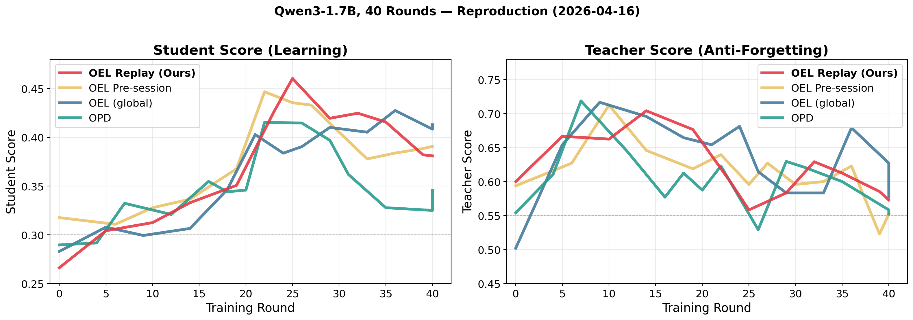

# On-Policy Context Distillation (OPCD) with Experience Learning

Experience-augmented on-policy distillation for agentic tool-use: accumulate structured experience across sessions, build stronger teacher signals via experience-augmented prompts, and train the student policy on-policy.

## Core Pipeline

For each session:

1. Student serves responses with current policy (bare prompt, no experience).
2. Teacher sees the same prompt **augmented with accumulated experience** and provides token-level supervision.
3. After session ends, extract structured experience items from the full conversation.
4. Experience accumulates across sessions (capped at 2048 tokens), creating a growing knowledge base.
5. Training uses top-K reverse KL divergence between student and experience-augmented teacher.

Over time, the student internalizes experience without needing it in the prompt at inference time.

## Option A: SDFT/SDPO-style (Per-Turn Distillation)

Per-turn distillation **without** persistent experience, following [SDFT](https://arxiv.org/abs/2601.19897) and [SDPO](https://arxiv.org/abs/2601.20802). Teacher signal comes from next-turn hindsight hints (ephemeral, not accumulated).

Loss: reverse KL over top-K bins (K=50) plus tail mass:

$$D_{KL}\left(\pi_\theta^{K+1}\|\pi_{teacher}^{K+1}\right)=\sum_{k=1}^{K+1}\pi_\theta^{(k)}\left(\log\pi_\theta^{(k)}-\log\pi_{teacher}^{(k)}\right)$$

```bash
cd slime
bash ../openclaw-opd/run_qwen3_1.7b_openclaw_opd_topk.sh
```

## Option B (Default): OEL/OPCD-style (Experience-Augmented Distillation)

Cross-session experience accumulation with post-hoc extraction and teacher replay:

1. **Phase 1**: Student generates all turns without teacher overhead.
2. **Phase 2**: After session ends, extract ONE structured experience from the entire conversation.
3. **Phase 3**: Replay teacher evaluation on ALL turns with the complete experience.
4. Submit all samples to training queue.

This ensures every turn (including Turn 1) benefits from full-session experience.

```bash
# Qwen3-1.7B, full-parameter, Megatron backend (paper default)
bash run_qwen3_1.7b_openclaw_oel_online.sh
```

Key args:

```bash
--loss-type custom_loss \
--custom-loss-function-path oel_distillation_loss.oel_distillation_loss_function \
--distill-topk 50 \
--disable-compute-advantages-and-returns \
--entropy-coef 0.00
```

## Key Results

Comparison on **Hard GSM8K** (36 problems, baseline accuracy <= 0.25), Qwen3-1.7B full-parameter, 40 training rounds, GPT-4.1 evaluator:

| Method | Baseline | Peak Student | Delta | Teacher (stable?) |
|--------|----------|-------------|-------|-------------------|
| **OEL/OPCD-style (Ours)** | 0.266 | **0.460** | **+0.194** | 0.56-0.70 |
| SDFT/SDPO-style | 0.290 | 0.415 | +0.126 | 0.53-0.72 |



Reproduce:
```bash
bash scripts/reproduce_all.sh           # all experiments (~8 hours)
python3 scripts/plot_3method_comparison.py  # regenerate figure
```

## File Layout

```text
openclaw-oel/
├── README.md
├── train_async.py                               # Async training entry point
├── openclaw_oel_api_server.py                   # API server: experience extraction + teacher query + sample submission
├── openclaw_oel_rollout.py                      # Rollout bridge to SLIME trainer
├── oel_distillation_loss.py                     # Top-K reverse KL loss (Megatron + FSDP)
├── run_qwen3_1.7b_openclaw_oel_online.sh        # 1.7B online (paper default)
├── run_qwen3_4b_openclaw_oel_online.sh          # 4B online, FSDP, LoRA
├── run_qwen3_4b_openclaw_oel_online_megatron.sh # 4B online, Megatron, full-param
├── scripts/
│   ├── reproduce_all.sh                         # One-click reproduction of all experiments
│   └── plot_3method_comparison.py               # Generate comparison figure
├── data/
│   ├── hard_problems_train.json                 # 36 hard GSM8K problems for training
│   └── hard_problems_eval.json                  # 36 hard GSM8K problems for evaluation
└── eval/
    ├── gsm8k_personal_agent.py                  # Experiment runner (training + evaluation loop)
    ├── personalization_evaluator.py             # GPT-4.1-based score evaluator
    ├── run_ms_api.py                            # Azure OpenAI API client
    ├── select_hard_problems.py                  # Hard problem selection (requires full GSM8K)
    └── results/                                 # Experiment results (JSON, auto-created)
```
